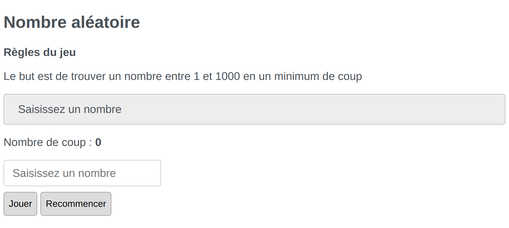
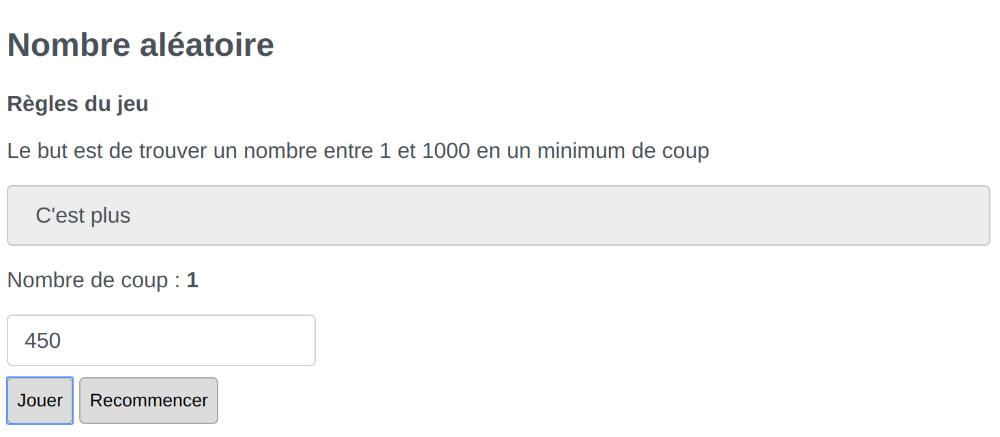
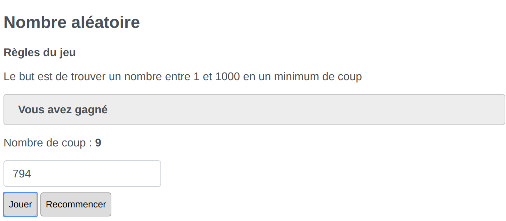
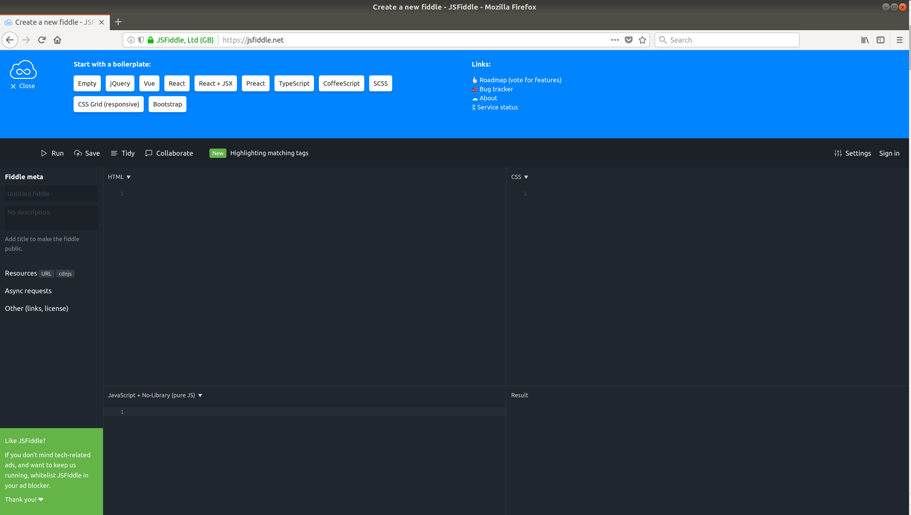
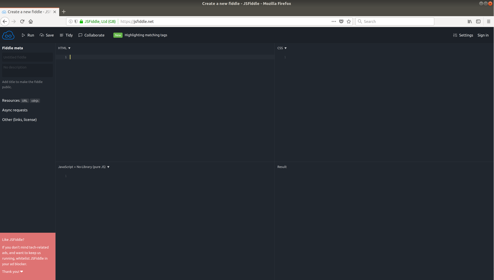
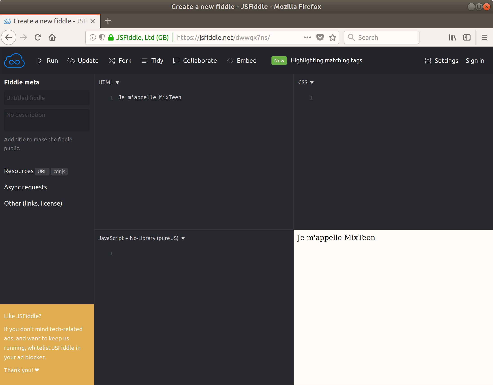
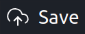
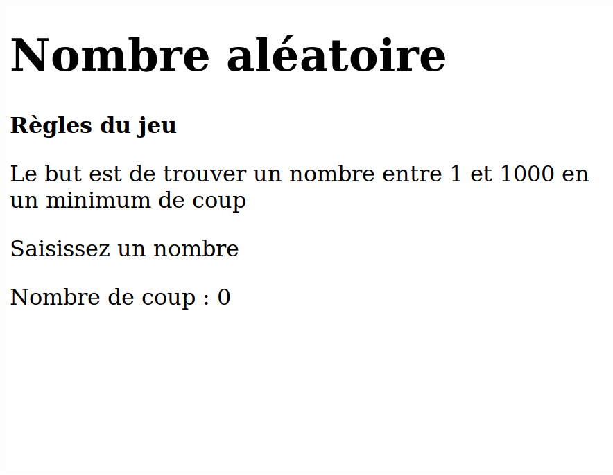
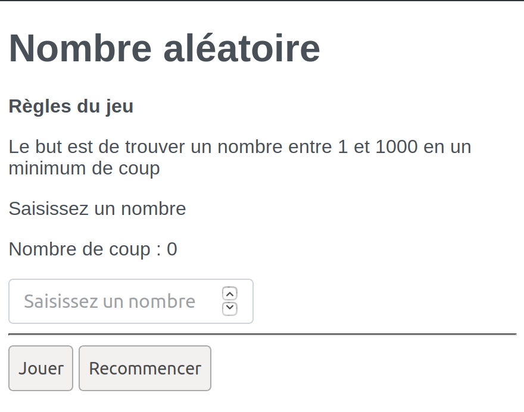

image::../ressources/images/logo.png[MixTeen]

== But de l'exercice

Nous allons créer un jeu simple en utilisant HTML et JavaScript. Si tu suis toutes les étapes à la fin tu devrais avoir une page qui ressemble à

Le but est de trouver le nombre que le programme aura aléatoirement choisi entre 1 et 1000. Si jamais tu renseignes un nombre trop petit et que tu cliques sur Jouer, le programme affichera un message "C'est plus".

Si le nombre est trop petit le message sera "C'est moins". Le nombre de coup sera compté et le but est de trouver la solution en moins de coup possible. Bien évidemment si le bon nombre est trouvé on indiquera au joueur qu'il a gagné

A toi de jouer

== Etape 1 : Utiliser jsfiddle

Une page web et ses ressources sont retournées à un navigateur par un serveur web. On peut installer un serveur web sur ta machine mais pour aller plus vite nous allons tout faire via le site https://jsfiddle.net/. Il permet de tester en ligne tes développements.

. Lance ton navigateur Internet. Tu peux utiliser Firefox qui est reconnaissable via cet icône image:images/firefox.png[Firefox, 24, 24]

. Dans la barre d'adresse tape le nom du  site https://jsfiddle.net/. Tu devrais avoir la page suivante qui s'ouvre  

. Dans la zone bleue en haut, clique sur la petite croix à gauche suivie du texte "Close" pour que l'éditeur occupe tout l'espace comme ci dessous 

. L'écran est découpé en 4 zones
* HTML c'est là que tu vas décrire le contenu de ta page en utilisant les balises du langage HTML
* CSS pour définir des styles qui permettent de mettre en forme le résultat
* JavaScript qui est la zone où notre programme sera écrit. A la base le HTML est statique, rien ne bouge. JavaScript permet de rendre les choses plus dynamiques. Dans notre cas le JavaScript sera lancé quand nous allons cliquer sur les boutons de l'écran
* La dernière zone est l'endroit où le résultat sera affiché

. Nous allons commencé par écrire un message dans la zone HTML. Par exemple `Je m'appelle MixTeen`. Une fois que c'est fait tu peux cliquer sur le bouton 

. Normalement à cette étape tu dois avoir le résultat suivant 

. Dans la barre de menu tu peux enregistrer ton travail via le bouton . Un numéro pas très lisible apparaît dans la barre d'adresse (par exemple `dwwqx7ns`). Tu peux garder cette adresse car elle te permettra de rouvrir ce que tu as fait pendant plusieurs jours https://jsfiddle.net/dwwqx7ns/

. Tu peux essayer de saisir le texte que tu veux et voir ce que donne le résultat

== Etape 2 : Création du HTML

Et si nous commencions à créer ce jeu ? Dans cette deuxième étape nous allons commençons à créer le formulaire de saisie

=== Tes premières lignes de HTML

. Tu peux effacer tout ce que tu as fait dans la première partie et nous allons commencer par créer le titre `Nombre aléatoire`. En HTML le titre se met entre des balise <h1>. Par exemple `<h1>Nombre aléatoire</h1>`

. Quand tu veux écrire du texte tu dois le mettre entre les balises `
` et `
`. Si tu veux mettre en gras du texte ce sont les balises `<b>` et `</b>`, pour la mise en italique c'est `<i>` et `</i>`, pour souligner c'est `<u>` et `</u>`. A toi de jouer essaye de créer le résultat suivant

=== Ajouter un champ de saisi et des boutons

L'ajout d'un champ de formulaire se fait en utilisant la balise `<input>`. Cette balise est un peu particulière car tu n'as pas besoin de préciser de balise fermante `</input>`. En HTML tu as 3 balises comme celle ci que tu n'as pas besoin de fermer : `<input>`, ` ` (qui permet d'aller à la ligne) et `
` (qui permet de tracer un trai de séparation)

. Tu peux donc créer ton premier champ en tapant <input type="number" placeholder="Saisissez un nombre"/>. Comme tu peux le voir on peut ajouter des propriétés à une balise. Dans cet exemple nous avons 2
* `type` qui permet de saisir le type de champ. Tu peux avoir `date`, `text`, `email`, `month`, `tel`, `color`...
* `placeholder` qui permet d'ajouter une aide en grisé quand le champ est vide. Par exemple ici on affiche un message pour saisir un nombre

. Place ce champ dans ta page dans jsfiddle

. Un bouton se définit en utilisant les balises `<button>` et `</button>`. Tu peux définir un bouton _Jouer_ et un bouton _Recommencer_

Ton formulaire doit ressembler à ça

=== Si on mettait un coup de peinture

Ce n'est pas obligatoire mais tu peux rendre ce que tu as fait plus joli en ajoutant des styles dans la zone CSS. Tu eux copier et coller les lignes ci dessous dans la zone CSS

[source,css]
----
/* on change la police d'écriture et la couleur */
html {
  font-family: Arial;
  color: #495057;
}

/**
 * Permet d'avoir des boutons un peu plus joli que le standart
 */
button {
  cursor: pointer;
  border-radius: 4px;
  font-weight: 400;
  padding: 0.5em;
  line-height: 1.5;
  border: 1px solid #aaaaaa;
}

/**
 * Redéfini les champs de saisie
 */
input {
  display: block;
  padding: .375rem .75rem;
  font-size: 1rem;
  line-height: 1.5;
  color: #495057;
  background-color: #fff;
  background-clip: padding-box;
  border: 1px solid #ced4da;
  border-radius: .25rem;
  margin-bottom: 0.5em;
}
----

Après ce coup de peinture en utilisant des styles ta page doit ressembler à

== Etape 3 : Utiliser JavaScript pour rendre les choses dynamiques

TODO
