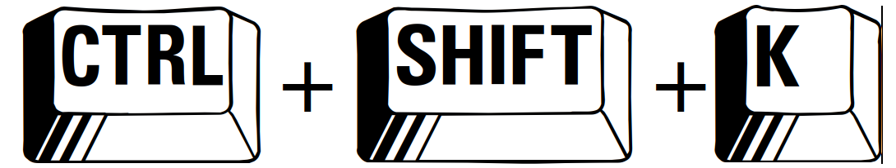

image::../ressources/images/logo.png[MixTeen]

== But de l'exercice

Nous allons créer un jeu simple en utilisant HTML et JavaScript. Si tu suis toutes les étapes à la fin tu devrais avoir une page qui ressemble à

Le but est de trouver le nombre que le programme aura aléatoirement choisi entre 1 et 1000. Si jamais tu renseignes un nombre trop petit et que tu cliques sur Jouer, le programme affichera un message "C'est plus".

image::images/jeu_resultat_plus.png[Capture d'écran du jeu à développer quand le joueur saisi un nombre trop petit, 500]

Si le nombre est trop petit le message sera "C'est moins". Le nombre de coup sera compté et le but est de trouver la solution en moins de coup possible. Bien évidemment si le bon nombre est trouvé on indiquera au joueur qu'il a gagné

A toi de jouer

== Etape 1 : Utiliser jsfiddle

Pour créer ce jeu tu vas te baser sur https://jsfiddle.net/[Jsfiddle]. Si tu ne sais pas ce que c'est ou comment ça marche, c'est simple tu peux suivre ces link:../exercice1/instructions.doc[instructions].

== Etape 2 : Création du HTML

Nous allons commençons à créer le formulaire de saisie

=== Tes premières lignes de HTML

. Tu peux effacer tout ce que tu as fait dans la première partie et nous allons commencer par créer le titre `Nombre aléatoire`. En HTML le titre se met entre des balise <h1>. Par exemple `<h1>Nombre aléatoire</h1>`. Si tu veux définir un sous titre tu peux utiliser la balise `<h2>`, un sous-sous titre la balise `<h3>`...

. Quand tu veux écrire du texte tu dois le mettre entre les balises `
` et `
`. Si tu veux mettre en gras du texte ce sont les balises `<b>` et `</b>`, pour la mise en italique c'est `<i>` et `</i>`, pour souligner c'est `<u>` et `</u>`. A toi de jouer essaye de créer le résultat suivant

=== Ajouter un champ de saisi et des boutons

L'ajout d'un champ de formulaire se fait en utilisant la balise `<input>`. Cette balise est un peu particulière car tu n'as pas besoin de préciser de balise fermante `</input>`. En HTML tu as 3 balises comme celle ci que tu n'as pas besoin de fermer : `<input>`, ` ` (qui permet d'aller à la ligne) et `
` (qui permet de tracer un trai de séparation)

. Tu peux donc créer ton premier champ en tapant <input type="number" placeholder="Saisissez un nombre"/>. Comme tu peux le voir on peut ajouter des propriétés à une balise. Dans cet exemple nous avons 2
* `type` qui permet de saisir le type de champ. Tu peux avoir `date`, `text`, `email`, `month`, `tel`, `color`...
* `placeholder` qui permet d'ajouter une aide en grisé quand le champ est vide. Par exemple ici on affiche un message pour saisir un nombre

. Place ce champ dans ta page dans jsfiddle

. Un bouton se définit en utilisant les balises `<button>` et `</button>`. Tu peux définir un bouton _Jouer_ et un bouton _Recommencer_

Ton formulaire doit ressembler à ça

=== Si on mettait un coup de peinture

Ce n'est pas obligatoire mais tu peux rendre ce que tu as fait plus joli en ajoutant des styles dans la zone CSS. Tu eux copier et coller les lignes ci dessous dans la zone CSS

[source,css]
----
/* on change la police d'écriture et la couleur */
html {
  font-family: Arial;
  color: #495057;
}

/**
 * Permet d'avoir des boutons un peu plus joli que le standart
 */
button {
  cursor: pointer;
  border-radius: 4px;
  font-weight: 400;
  padding: 0.5em;
  line-height: 1.5;
  border: 1px solid #aaaaaa;
}

/**
 * Redéfini les champs de saisie
 */
input {
  display: block;
  padding: .375rem .75rem;
  font-size: 1rem;
  line-height: 1.5;
  color: #495057;
  background-color: #fff;
  background-clip: padding-box;
  border: 1px solid #ced4da;
  border-radius: .25rem;
  margin-bottom: 0.5em;
}
----

Après ce coup de peinture en utilisant des styles ta page doit ressembler à

image::images/exemple3.png[Utilisation de style, 500]

== Etape 3 : Utiliser JavaScript pour rendre les choses dynamiques

Pour le moment il ne se passe rien quand on clique sur le bouton jouer. On va utiliser du JavaScript pour donner de la vie à cette page et la rendre plus dynamique

=== Mes premiers pas en Javascript

. Avant de commencer comme tu es maintenant un vrai développeur Web qui fait du HTML, du CSS et maintenant du JavaScript, nous allons ouvrir la console développeur. Pour celà tape en même temps sur les touches . Une fenêtre doit apparaître en bas du navigateur. C'est la console des développeurs 

. Tu peux écrire maintenant dans la zone JsFiddle réservée à JavaScript l'instruction `console.log('Bonjour tout le monde')`

. Une fois que c'est fait clique sur le bouton . Normalement tu dois voir le message _Bonjour tout le monde_ dans la console

Le but n'est pas d'expliquer tout JavaScript ici si tu veux en savoir plus je te conseille de suivre la présentation mais voici un exemple de code

[source,javascript]
----

/* Tout ce qui est entre / * et * / est un commentaire. Il en est de même pour tout ce qui suit // */
// Le langage utilise beaucoup d'anglais :-(

/* En Javascript on peut créer des variables. Une variable est comme un sac qui peut contenir soit rien, soit un nombre, soit du texte (on parle de chaîne de caractères), soit vraie ou faux (on parle de booléen et en anglais on écrit true ou false). Ce sac peut avoir un nom */
let nom = "MiXTeen"
let age = 12
let estMajeur = false
let sac = undefined // Correspond à vide

----

https://jsfiddle.net/k6toyssv/

